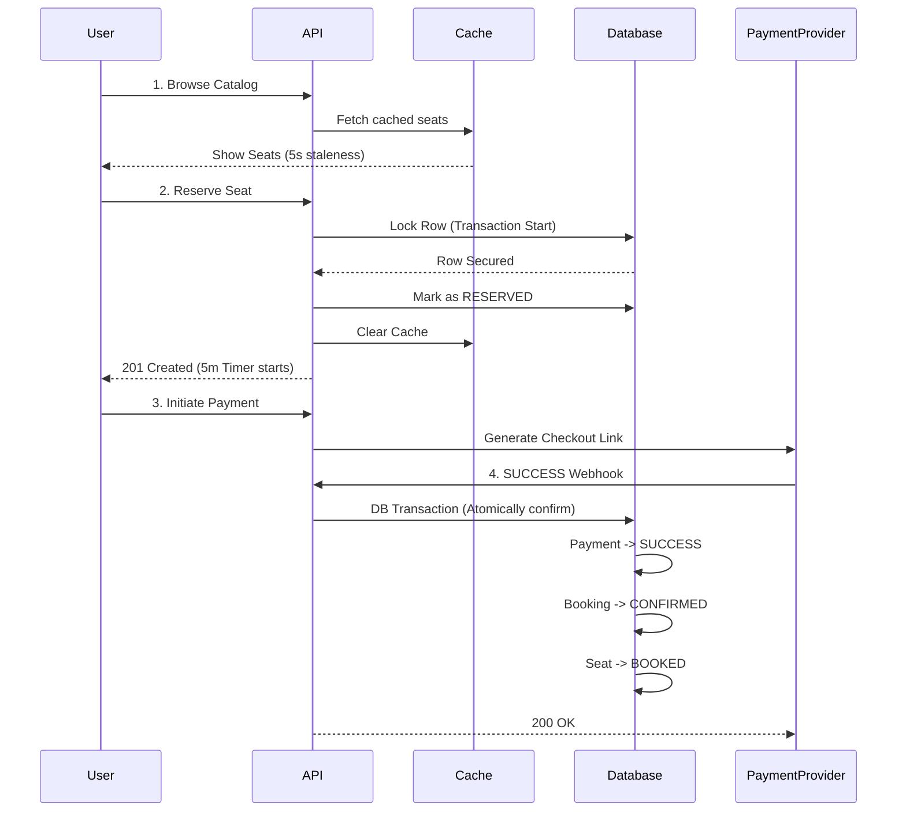

# Jameya Marketplace – Technical Overview for Stakeholders

This document provides a high-level overview of the architectural safeguards and technical design of the Jameya Marketplace seat booking system. This system is engineered to handle high-traffic bursts (thousands of users per second) while maintaining "Fintech-grade" consistency and financial safety.

---

## 1. Executive Summary

The Jameya Marketplace enables users to join collaborative savings groups by purchasing "seats" (payout months). Because payout months are unique and highly competitive, the system prioritizes **Strict Consistency** over performance, ensuring that no stool is ever sold twice and no user is ever charged without a guaranteed reservation.

---

## 2. Core Architectural Pillars

### 🛡️ Guaranteed Consistency (No Double-Booking)
We utilize a **multi-layered locking strategy** to handle "thundering herd" scenarios where many users click the same popular seat at once.
*   **Layer 1: Redis Lock:** An ultra-fast distributed lock that prevents simultaneous entry into the booking logic for the same seat.
*   **Layer 2: SQL Row Locking:** Inside a database transaction, we use `SELECT FOR UPDATE` to lock the seat record, ensuring that even if the Redis lock fails, the database remains the ultimate source of truth.

### 💳 Financial Safety (Reserve-First Workflow)
To protect users and the platform, we follow a strict **Reserve-First** pattern:
1.  A user **secures** a 5-minute reservation.
2.  **Only then** is a payment intent created.
3.  This ensures we never pull funds from a user unless the inventory record is already locked in their favor.

### 🔄 Fintech Reliability (Idempotency)
Payment providers often suffer from network jitter or duplicate delivery. Our system is built to be **Idempotent**:
*   Every payment event is stamped with a unique `provider_event_id`.
*   If we receive the same "Payment Success" signal twice, the system ignores the second one but acknowledges it correctly, preventing duplicate seat allocations or status corruption.

### 🚀 Scalability (Intelligent Caching)
To keep the marketplace feeling fast, we employ **Redis Caching**:
*   Catalogue browsing uses a 5-second "TTL" cache.
*   Whenever a seat is reserved or booked, the system **proactively invalidates** (clears) the cache so other users see the updated status immediately.

---

## 3. The Booking Lifecycle

---

## 4. Maintenance & Reliability

### Automated Janitor (Expiry Job)
If a user reserves a seat but abandons the transaction, a background worker runs every 30 seconds to:
1.  Identify stale reservations.
2.  Atomically release the seats back to `AVAILABLE`.
3.  Invalidate the cache to alert other users that the seat is back on the market.

### System Safety
*   **Atomic Transactions:** Every critical state change (Booking -> Confirmation) happens in an "all or nothing" database transaction.
*   **Environment Validation:** The system strictly validates KYC and eligibility (currently mocked as 'VERIFIED') before allowing a reservation.

---

## 5. Summary of Benefits
*   **Zero Overbooking:** Technically impossible under current architecture.
*   **Zero "Zombie" Payments:** No one is charged without a seat.
*   **High Performance:** Caching ensures the app feels local-speed during browsing.
*   **Cloud Ready:** Built with horizontal scaling in mind (PostgreSQL + Redis).
